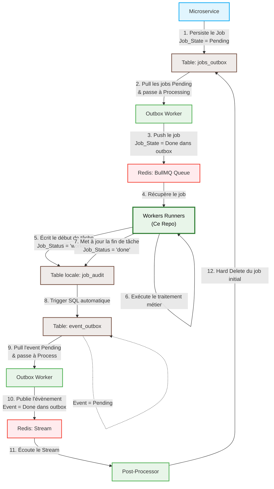

# Workers Runners 🏃‍♂️📦

Ce dépôt contient les **Workers** chargés de l'exécution asynchrone des tâches lourdes et des processus d'arrière-plan. Il s'intègre dans une architecture microservices multi-dépôts basée sur le **Transactional Outbox Pattern** pour garantir une communication fiable et _at-least-once delivery_ sans couplage direct entre les services.

## 🏗️ Architecture & Dépendances

Le projet s'appuie fortement sur notre écosystème multi-repo :

- **`npm-packages`** : Notre dépôt central de bibliothèques partagées. Les workers étendent la classe `BaseWorker` et importent les définitions de domaines, les interfaces et les configurations globales depuis ce package.
- **Redis / BullMQ** : Utilisé comme broker de messages haute performance pour la distribution et le queuing des jobs vers les runners.

---

## 🔄 Cycle de Vie Complet d'un Job (Transactional Outbox)

Pour garantir la résilience du système, aucun Microservice (MS) ne pousse directement dans Redis. Tout passe par des tables d'Outbox transactionnelles.

Voici le flux complet, de l'initialisation du job jusqu'à son nettoyage final :

