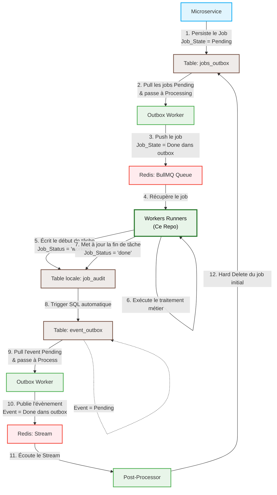

# Workers Runners 🏃‍♂️📦

Ce dépôt héberge la flotte de **Workers Runners** de Volontariapp. Ces runners exécutent de manière asynchrone les tâches lourdes et les processus d'arrière-plan du système. 

L'architecture est entièrement construite sur des **Contextes d'Application Standalone NestJS** (sans pile HTTP ni serveur Express/Fastify), garantissant une empreinte RAM minimale (ultra-légère) et un boot-up instantané, tout en conservant la puissance de l'injection de dépendances de NestJS et de la gestion de files d'attente `@nestjs/bullmq`.

---

## 🏗️ Architecture & Flux Outbox Transactionnel

Pour garantir une communication résiliente et une livraison de messages de type *at-least-once*, aucun microservice ne pousse directement de tâches dans Redis. Tout transite par des tables d'Outbox SQL transactionnelles.

Voici le cycle de vie complet d'un Job, de sa création à son nettoyage final :



---

## 📂 Organisation de la Flotte de Workers

Chaque microservice runner est modulaire, autonome (dispose de son propre fichier `yarn.lock` pour éviter les conflits de dépendance) et s'écoute sur son propre port de diagnostic :

```
workers-runners/
├── worker-user/            # 👤 Gestion du profil utilisateur & emails de bienvenue
├── worker-event/           # 📅 Gestion du cycle de vie des évènements
├── worker-post/            # 📝 Traitement et publication des publications/posts
└── worker-social/          # 👥 Traitement des interactions sociales (abonnements)
```

### 📋 Registre des Binds Port & File d'attente (BullMQ)

Les types de jobs et les files d'attente BullMQ sont fortement typés à l'aide de notre bibliothèque de contrats partagés `@volontariapp/messaging` :

| Nom du Worker | Port Interne | File d'attente BullMQ | Type de Job Consommé | Handler Métier |
| :--- | :---: | :--- | :--- | :--- |
| **`worker-user`** | `4102` | `UserQueue.USER` | `user.send_welcome_email` <br> `user.reset_password` | `SendWelcomeEmailHandler` <br> `ResetPasswordHandler` |
| **`worker-event`** | `4103` | `EventsQueue.EVENTS` | `events.publish_event` | `PublishEventHandler` |
| **`worker-post`** | `4104` | `PostQueue.POST` | `post.publish_post` | `PublishPostHandler` |
| **`worker-social`** | `4105` | `SocialQueue.SOCIAL` | `social.follow_user` | `FollowUserHandler` |

---

## 🧠 Deep-Dive Architectural & Concepts Avancés

L'architecture technique de cette flotte de runners intègre plusieurs concepts clés de l'ingénierie logicielle moderne pour garantir une robustesse et des performances optimales en production.

### ⚡ 1. Contextes d'Application Standalone NestJS (Sans Pile HTTP)
Contrairement aux applications NestJS traditionnelles qui démarrent un serveur HTTP complet (Express ou Fastify) qui reste à l'écoute d'un port TCP, nos workers utilisent des **Contextes d'Application Standalone**.

En bootstrapant l'application via :
```typescript
const app = await NestFactory.createApplicationContext(AppModule);
```
Le conteneur NestJS charge tous les modules, configure les injections de dépendances (Postgres, Redis, Repositories) et commence à écouter les files d'attente de messages en tâche de fond, **sans allouer de ressources réseau ou mémoire pour une pile HTTP**.
*   **Empreinte RAM minimale** (divisée par 4 par rapport à un serveur complet).
*   **Temps de démarrage instantané** (< 500ms).
*   **Idéal pour le Serverless** ou le déploiement de conteneurs Kubernetes ultra-denses.

### 🛡️ 2. Injection de Dépendances Explicite (Robuste sous `tsx` & `esbuild`)
Les compilateurs ultra-rapides modernes (tels que `tsx` utilisé en développement local ou `esbuild`) optimisent l'exécution en ignorant l'émission des métadonnées de types JavaScript hérités (l'option `emitDecoratorMetadata` de TypeScript). Dans un framework fortement basé sur la réflexion comme NestJS, cela peut conduire à des dépendances non résolues (`undefined` à l'injection).

Pour pallier ce problème de manière robuste, tous nos constructeurs de workers injectent leurs dépendances en utilisant les décorateurs **explicites** de NestJS :
```typescript
constructor(
  @Inject(JobAuditRepository) auditRepo: JobAuditRepository,
  @Inject(PublishEventHandler) handler: PublishEventHandler,
) {
  super(auditRepo);
  // ...
}
```
Cette architecture garantit une résolution de types 100% fiable et sans erreur, indépendamment de la chaîne de build ou du compilateur utilisé (TypeScript classique, TSX, SWC, Esbuild).

### 🔄 3. Synchronisation Automatique du Schéma TypeORM en Local
En environnement de développement (`local`/`development`), la connexion à PostgreSQL a l'option **`synchronize: true`** activée dans nos providers de connexion :
```typescript
const dbProvider = new PostgresProvider({
  ...(instanceToPlain(config) as IPostgresConfig),
  entities: [JobAuditModel],
  synchronize: true,
});
```
Cette configuration permet à TypeORM d'analyser l'état des entités chargées (comme le modèle d'audit `JobAuditModel`) et de synchroniser automatiquement le schéma de la base de données locale (en créant la table `job_audit` si elle est manquante) à chaque démarrage, éliminant ainsi le besoin de jouer manuellement des scripts SQL ou des migrations complexes en local.

### 🔌 4. Cycle de Vie et Libération Propre des Pools de Connexion (Graceful Shutdown)
Pour éviter les fuites de sockets TCP, les ports orphelins et les connexions fantômes sur le serveur de base de données PostgreSQL ou Redis, nous gérons proprement le cycle de vie de l'application NestJS. 

L'**`AppModule`** implémente l'interface **`OnModuleDestroy`** de NestJS :
```typescript
export class AppModule implements OnModuleDestroy {
  constructor(
    private readonly postgresProvider: PostgresProvider,
    private readonly redisProvider: RedisProvider,
  ) {}

  async onModuleDestroy() {
    logger.info('Shutting down background connection providers...');
    await Promise.all([
      this.postgresProvider.disconnect(),
      this.redisProvider.disconnect(),
    ]);
  }
}
```
Dès que le conteneur reçoit un signal d'arrêt du système d'exploitation (`SIGINT` ou `SIGTERM`), NestJS déclenche séquentiellement la destruction du module. Notre code ferme alors proprement tous les pools de connexions ouverts. Le processus Node s'éteint ainsi proprement (Graceful Shutdown), sans perte de données.

---

## 🎮 Command Center — `command.sh`

Un panneau de contrôle en ligne de commande interactif et élégant est disponible à la racine du projet pour simplifier le travail quotidien des développeurs.

Pour le lancer :
```bash
./command.sh
```

### 🛠️ Options Disponibles

*   **`1) Install All`** : Installe proprement les dépendances de chaque worker via `yarn install`.
*   **`2) Build All`** : Compile l'intégralité des workers (`tsc`).
*   **`3) Lint All`** : Analyse le code et corrige automatiquement les écarts de style (`eslint --fix`).
*   **`4) Test All`** : Exécute toutes les suites de tests unitaires (`jest`).
*   **`5) Clean All`** : Efface les dossiers `node_modules` et les builds de distribution `dist` de chaque projet.
*   **`6) Bump Internal Deps`** : Analyse et met à jour automatiquement toutes les références internes de nos packages `@volontariapp/*` (comme `@volontariapp/messaging`, `@volontariapp/config`, etc.) vers leurs versions locales ou de registre les plus récentes.
*   **`7) Add/Update Pkg`** : Installe ou met à jour une dépendance npm simultanément sur l'ensemble des workers.
*   **`8) Run All (Local)`** : Lance **simultanément et en parallèle** tous les workers détectés sur ton terminal grâce à `concurrently` (idéal pour déboguer le flux complet localement).

---

## 🛡️ Intégration Continue (CI/CD)

Le projet intègre un pipeline de validation automatisé par **GitHub Actions** (`.github/workflows/ci.yml`) :

1.  **Validation Matricielle en Parallèle** : À chaque Push ou Pull Request vers `main`/`master`, le pipeline lance en parallèle un job de vérification pour **chacun** des 4 workers.
2.  **Mise en cache** : Les dépendances Yarn de chaque runner sont mises en cache de façon isolée (basée sur leur `yarn.lock` respectif).
3.  **Qualité & Robustesse** : Le pipeline garantit la validation du linter (`yarn lint`) et la réussite de la compilation du build (`yarn build`).
4.  **Déploiement Continu (CD)** : Dès que le code est fusionné dans `main`, le pipeline met à jour de façon sécurisée et transparente le sous-module Git `workers-runners` dans le dépôt central de production **`Volontariapp/deploy`**, garantissant un déploiement continu instantané !
